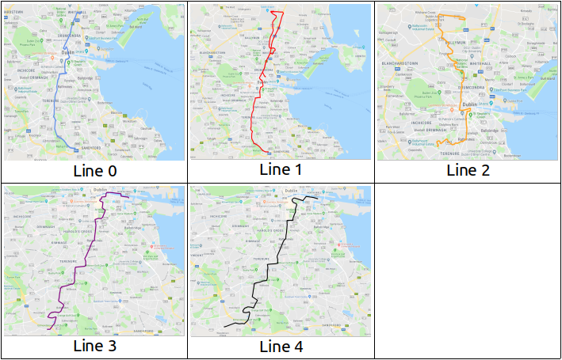
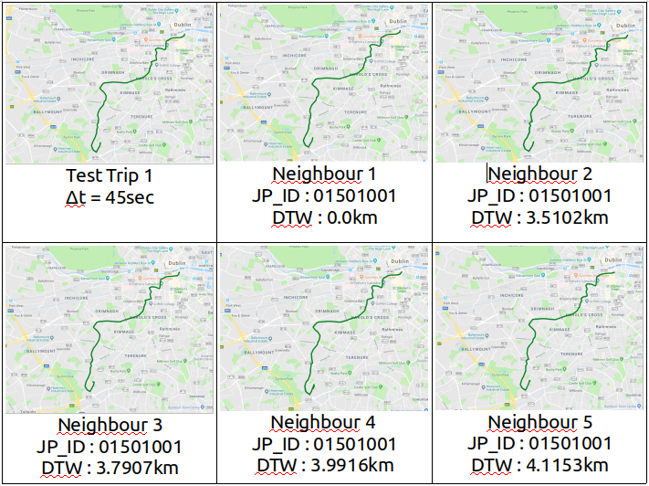
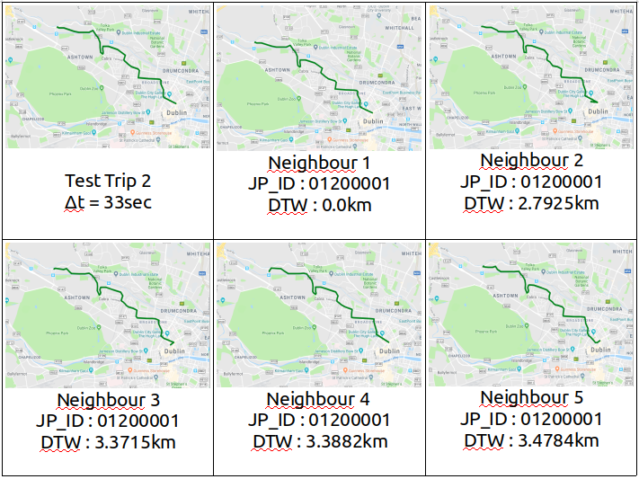
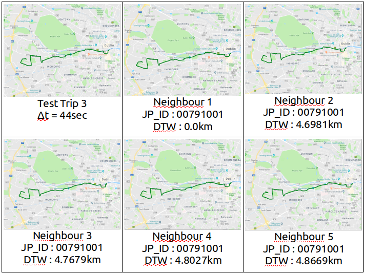
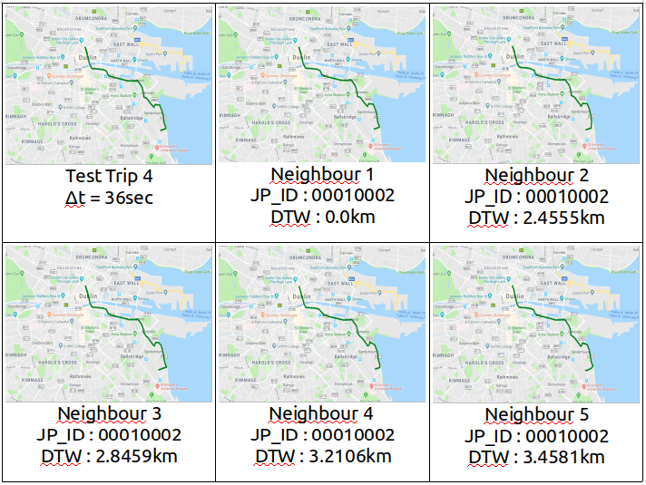
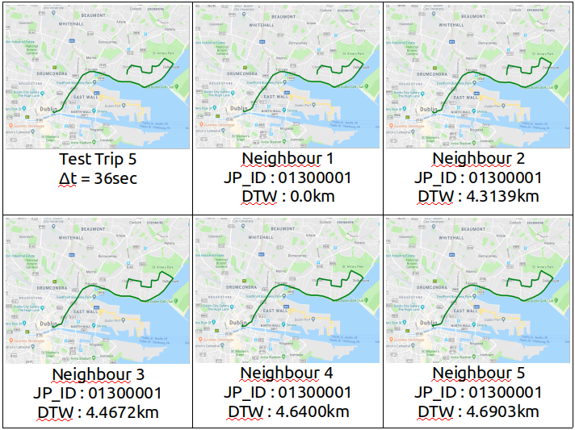
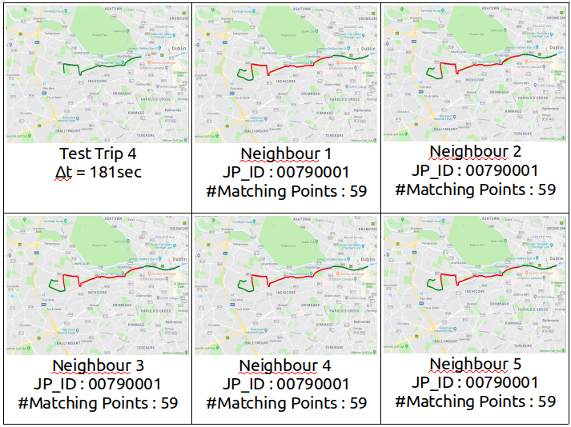

# Datamining Assignment 2
##  Συγγραφείς:
* Ιωάννης Μαλιάρας : 1115201500084
* Ιωάννης Χείλαρης : 1115201500176

### Γενικές Σημειώσεις:
* Το παρόν αρχείο είναι γραμμένο σε Markdown. Μέσα στον φάκελο της εργασίας βρίσκονται το .md, το .pdf και το .html αρχείο.
* Οι πίνακες είναι αποθηκευμένοι με τη μορφή .png και βρίσκονται στο φάκελο **Tables/**.
* Όλα τα .csv αρχεία βρίσκονται στο φάκελο **sets/**

## Ερώτημα 1:
Το αρχείο που παράγει τους χάρτες σε μορφή html είναι το [**q1.py**][q1]  

Αρχικά, διαβάζει το αρχείο [train_set.csv][trainSet] και παίρνει 
ενα – ενα τα entries έτσι ώστε να μην επιλέξει 
μια διαδρομή 2 φορές (με τη χρήση ενός set). 
Εν τέλει επιλέγει, έτσι, 5 διαφορετικές διαδρομές και τις 
κάνει plot. Τα html αρχεία είναι αποθηκευμένα στον φάκελο **q1plots/**. 
Παρακάτω παρουσιάζονται τα αποτελέσματα του προγράμματος:

  

## Ερώτημα 2:
### Α1)
Ο αλγόριθμος DTW δεν υλοποιήθηκε από εμάς. Κατεβάσαμε την υλοποίση μέσω 
αυτου του [συνδέσμου](https://pypi.org/project/fastdtw/)  

Το αρχείο κώδικα που φτιάχτηκε για αυτό το ερώτημα είναι το [**a1.py**][a1], το οποίο διαβάζει τα 2 sets και κάνει τη δουλειά που του ζητείται.  

Όλα τα αρχεία του ερωτήματος βρίσκονται στον φάκελο **a1/**.
Οι εικόνες και τα meta data του κάθε γείτονα κλπ 
βρίσκονται όλα ταξινομημένα στον φάκελο **a1plots/**. 
Για παραπάνω πληροφορίες, βλ. κώδικα.  

Τα αποτελέσματα του προγράμματος παρουσιάζονται παρακάτω :

* Test Trip 1

* Test Trip 2

* Test Trip 3

* Test Trip 4

* Test Trip 5

### A2)
Για κάθε ενα entry του αρχείου [**test_set_a2.csv**][testSeta2], το πρόγραμμα [**a2.py**][a2] ψάχνει τους 5 γείτονες με μέγιστη κοινή υπακολουθία σημείων διαδρομής μέσω brute force. Η εύρεση της μέγιστης κοινής υπακολουθίας 2 trajectories γίνεται με επαναληπτική δημιουργία του πίνακα του αλγορίθμου στον οποίο κάνουμε backtrack για να χτιστεί η μέγιστη κοινή υπακολουθία.  
Ο αλγόριθμος γράφτηκε απο εμάς βάσει θεωρίας και ψευδοκώδικα της [Wikipedia](https://en.wikipedia.org/wiki/Longest_common_subsequence_problem).  

Όλα τα αρχεία του ερωτήματος αυτού βρίσκονται στον φάκελο **a2/**. Οι εικόνες και τα metadata (αποτελέσματα του προγράμματος) βρίσκονται στον φάκελο **a2/a2Plots/**

Τα αποτελέσματα του προγράμματος παρουσιάζονται παρακάτω:

* Test Trip 1

* Test Trip 2

* Test Trip 3

* Test Trip 4

* Test Trip 5

### Ερώτημα 3

Το ερώτημα 3 υλοποιείται από τα αρχεία:
* [**q3.py**][q3]
* [**knearestbrute.py**][knearestbrute]
* [**knntest.py**][knntest]

Το [**knearestbrute.py**][knearestbrute] είναι η δικιά μας υλοποίηση knearestneighbour classifier, η οποία χρησιμοποιεί dtw me harvesine για να υπολογίσει αποστάσεις μεταξύ trajectories. Η αναζήτηση γίνεται εξαντλητικά. Η υλοποίηση είναι περίπου ίδια με την υλοποίηση που είχαμε φτιάξει στην προηγούμενη εργασία, ελαφρώς διαφορετική, ώστε να δουλεύει με τα δεδομένα που δίνονται.  
To [**knntest.py**][knntest] υλοποιεί 10-fold cross validation για το 1/10 του train_set χρησιμοποιώντας τον classifier knearestbrute. Το 10-fold cross-validation υλοποιήθηκε από εμάς.  

Τα αποτελέσματα είναι τα παρακάτω:

* _Precision_ :  	0.872995
* _Recall_: 	    0.876711
* _F1_ :		    0.872153
* _Accuracy_ : 	    0.955384
* _Time Taken_ :    13599.5 sec

To [**q3.py**][q3] υλοποιεί το ζητούμενο του ερωτήματος 3. Διαβάσει τα [train_set][trainSet], [test_set_a2][testSeta2] κάνει fit από το [train_set][trainSet] και κάνει  predict το [test_set][testSeta2]. Γράφει τα αποτελέσματα στο [**testSet_JourneyPatternIDs.csv**][predictions]

[q1]: ./q1/q1.py
[a1]: ./q2/a1/a1.py
[a2]: ./q2/a2/a2.py
[lcss]: ./q2/a2/lcss.py
[q3]: ./q3/q3.py
[knearestbrute]: ./q3/knearestbrute.py
[knntest]: ./q3/knntest.py
[trainSet]: ./sets/train_set.csv
[testSeta1]: ./sets/test_set_a1.csv
[testSeta2]: ./sets/test_set_a2.csv
[predictions]: ./sets/testSet_JourneyPatternIDs.csv